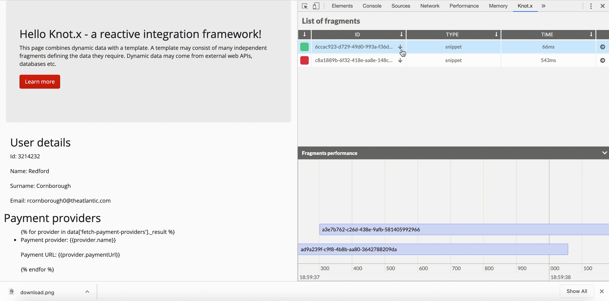

# Knot.x Fragments Chrome Extension
Extends the Developer Tools, adding a sidebar that displays [Fragments](https://github.com/Knotx/knotx-fragments)
data associated with the selected DOM element.

<p align="center">
  
</p>

It is a [bridge between the business logic (domain) and the solution](https://tech.cognifide.com/blog/2020/knotx-chrome-extension/).
Domain experts can easily verify the implementation of [business logic](https://knotx.io/blog/how-to-understand-business-logic/),
define new scenarios and deal with network problems (defining fallbacks) gradually. Developers and
QAs can easily learn business logic, verify API responses/delays, and check page rendering performance issues.

See the [tutorial](https://knotx.io/tutorials/chrome-extension/2_2/) and watch the [live demo](https://www.youtube.com/watch?v=EWoHqzYGv0w)
for more details.

## How to use?
> We are going to publish the extension on the [Chrome Web Store](https://chrome.google.com/webstore)
platform. The acceptance process will take some time.

- Download the extension from [GitHub releases](https://github.com/Knotx/knotx-fragments-chrome-extension/releases),
the latest version is available [here](https://github.com/Knotx/knotx-fragments-chrome-extension/releases/download/2.2.0/knotx-chrome-extension-2.2.0.zip).
- Unzip the downloaded file
- Load the extension from disk (more details [here](https://developer.chrome.com/extensions/getstarted) )
  - open the Chrome Extension Management page by navigating to `chrome://extensions`.
  - enable Developer Mode by clicking the toggle switch next to *Developer mode*.
  - click the *LOAD UNPACKED* button and select the unzipped `knotx-chrome-extension-SVERSION` directory.

If you want to play with the extension using sample HTML Knot.x responses, see the instructions below:
- Run `samples`
  - go to the `assets/samples` folder
  - run command: `npm install http-server -g`
  - run command: `npx http-server`
- See the extension in action
  - open the sample pate by navigating to [127.0.0.1:8080/payments.html](http://127.0.0.1:8080/payments.html) or [127.0.0.1:8080/payments.json](http://127.0.0.1:8080/payments.json)
  - activate the Chrome Dev Tools (`F12`)
  - select the Knot.x panel

## How does it work?
Knot.x Fragments, when run in [debug mode](#knotx-http-server-debug-mode), injects information about fragments into
the output. This information can then be read, parsed and displayed by various tools. Knot.x
Fragments Chrome Extension is the official tool for this purpose.

Of course fragments' outputs can have various formats. Currently, Knot.x supports injecting debug
information into both `JSON` and `HTML` responses.

When Knot.x HTTP response content type is `application/json` then it is parsed as JSON (according to
[RFC-4627](https://www.ietf.org/rfc/rfc4627.txt)). Otherwise, the extension interprets the response
as an HTML.

### Knot.x HTTP Server debug mode
Fragments debugging requires some Knot.x configuration changes. Knot.x provides [Fragment Execution Log Consumer's](https://github.com/Knotx/knotx-fragments/tree/master/task/handler/log)
implementations that write a [fragment execution log](https://github.com/Knotx/knotx-fragments/tree/master/task/handler/log#what-is-the-execution-log) to:
- `JSON` response using [Json Consumer](https://github.com/Knotx/knotx-fragments/tree/master/task/handler/log/json)
- `HTML` response using [HTML Body Writer](https://github.com/Knotx/knotx-fragments/tree/master/task/handler/log/html)

## Contributors section
This section contains implementation details. **We strongly encourage you to contribute!**

### Extension components
> Extensions are made of different, but cohesive, components. Components can include background
> scripts, content scripts, an options page, UI elements and various logic files.
([source](https://developer.chrome.com/extensions/getstarted))

Knot.x extension is made of such components as:
- `content script` that reads the HTTP response body that has been loaded in the browser and send
- `background script` that listens for browser events and communicates with a durable storage.

> Extension components are created with web development technologies: HTML, CSS, and JavaScript.
> ([source](https://developer.chrome.com/extensions/getstarted))

Knot.x extension is a single page application written in [React](https://reactjs.org/)
with [Redux](https://redux.js.org/) as storage.

The `src/js/content/content.js` script parses the HTTP response body (per browser tab) and sends
the message with fragments debug data to the `src/js/background/background.js` (which wraps
the [`Redux` storage](#storage-redux)). Then [React components](#react-components) read the data directly from the `Redux`
storage. See the diagram below.

```
Knotx.x HTTP Server -> HTTP response body -> CONTENT SCRIPT -> BACKGROUND SCRIPT -> REDUX -> COMPONENTS
                                                   ^
                                                   |
                                           parsing debug data
```

#### Parsing debug data
The chrome extension uses 3 parsers to read the fragment data in HTML.

```
•
└── helpers
    ├── graph
    │   └── declarationHelper.js
    ├── timeline
    │   └── declarationHelper.js
    └── nodesHelper.js
```

##### Nodes parser

The `nodesHelper.js` lists all the fragments on the page.
It provides `parseFragments` method that takes an HTML element (the whole document, in practice) and returns a list of all fragments like this:

```json5
[
  {
    "debug": {}, // raw debug data from the fragment's script tag
    "nodes": [
      {
        "tag": "div",
        "selector": "css-selector-for-this-node-only"
      },
      // more nodes ...
    ]
  },
  // more fragments ...
]
```

It works by traversing all HTML nodes using [Node Iterator](https://developer.mozilla.org/en-US/docs/Web/API/NodeIterator) and finding pairs of Knot.x comments that mark the beginning and end of a fragment.
It then:
- finds all top-level nodes in between (comments' siblings),
- reads debug data from the first one (which is always a script tag with debug data),
- and transforms the data into the above form

##### Graph parser

The `graph/declarationHelper.js` parses a given fragment's debug JSON (from the fragment's script tag) into a form understandable by (Vis.js Network)[https://visjs.github.io/vis-network/docs/network/], a library for displaying graphs.
It provides `constructGraph` method that takes fragment's JSON as input and returns Vis.js-compatible datasets:

```json5
{
  "nodes": [
    {
      "id": "node-id",
      "label": "A node",
      "group": "success",
      "level": 0
    },
    // ...
  ],
  "edges": [
    {
      "from": "node-id",
      "to": "another-node-id",
      "label": "_success",
      "dashes": false,
      "font": {
        "color": "00CC00"
      },
      "color": "#000000"
    },
    // ...
  ]
}
```

It is then ready to be displayed in the form of a graph (specifically a tree unless there are composite nodes in the fragment).

Internally the parser consists of two phases:
- flattening - The fragment's graph is normally a tree (an undirected graph in which any two vertices are connected by exactly one path). However, composite nodes reference subtasks which are another tree each. This phase creates a new graph structure where all the nodes are part of this graph (there are no sub-graphs).
- datasets creation - In this phase, the flattened graph is traversed depth-first and the above datasets are constructed.

Flattening of the graph transforms a structure like this:

```json5
{
  "id": "composite-node",
  // ...
  "on": {
    "_success": {
      "id": "next-node"
      // ...
    }
  },
  "subtasks": [
    {
      "id": "subtask-1",
      // ...
    },
    {
      "id": "subtask-2",
      // ...
    }
  ]
}
```

Into a graph like this:

```json5
{
  "id": "composite-node_virtual",
  // ...
  "on": {
    "_subtask_0": {
      "id": "subtask-1",
      // ...
      "on": {
        "_subtask_end": {
          "id": "composite-node_virtual_end",
          // ...
          "on": {
            "_success": { // original transition
              "id": "next-node",
              // ...
            }
          }
        }
      }
    },
    "_subtask_1": {
      "id": "subtask-2",
      // ...
      "on": {
        "_subtask_end": "composite-node_virtual_end" // note this is only an ID (!)
      }
    }
  }
}
```

An important thing to note is that, while all subtasks end with a transition to the `composite-node_virtual_end` node, only one of them (the deepest) contains an actual object in the transition.
All other subtasks end with a transition into a string. It's termed `a reference` in the code and it's an ID of the actual node.
It is like that to avoid duplication. Without it, the dataset-creation algorithm would treat transisions to the same node as transitions to multiple unique nodes.
It'd result in parts of graph being copied multiple times, instead of multiple transitions transitioning to the same node.

##### Timeline parser

The `timeline/declarationHelper.js` parses a given fragment's debug JSON (from the fragment's script tag) into a form understandable by (Vis.js Timeline)[https://visjs.github.io/vis-timeline/docs/timeline/], a library for displaying Gantt charts.
It provides `constructTimeline` method that takes fragment's JSON as input and returns Vis.js datasets.

Output looks like this:

```json5
{
  "items": [ // not an actual array, a vis.DataSet object
    {
      "id": "a-node",
      "start": 100000, // timestamp
      "end": 20000, // timestamp
      "content": "", // items have no labels in the currect implementation
      "group": "A group"
    },
    // ...
  ],
  "groups": [ // not an actual array, a vis.DataSet object
    {
      "id": "A group",
      "order": 0,
      "content": "A group",
      "nestedGroups": ["another group id", "and another one"] // null in case of no subgroups (can't be an empty array because of how Vis.js displays it)
    },
    // ...
  ]
}
```

Parser consists of the following phases:
- constructing a unique-labeled graph - node labels are later used as group names/IDs so they have to be unique. In case of duplicated IDs they are numerated: `label`, `label (#2)`, `label (#3)`, etc
- filtering processed nodes - for this chart we're interested in the processed nodes only
- creating `itmes` and `groups` datasets

### React components
The components structure is:
```
•
└── App:
    ├── SidePanel
    │   ├── FragmenList
    │   │   └── FragmentListItem
    │   │       └── NodeList
    │   └── FragmentGannt
    │
    └── MainPanel
        └── Graph
            ├──  Timeline
            ├──  Legend
            │    └── LegendSection
            └──  NodeInfo
```

You can find interactive documentation for all components in our [storybook](https://storybook.js.org/).

To open the storybook follow the steps below:
- run command ``` yarn storybook ```
- go to [localhost:6006](http://localhost:6006/)

#### Graph && timelines
We use `vis.js` library:
* [vis-network](https://visjs.github.io/vis-network/docs/network/)
* [vis-timeline](https://visjs.github.io/vis-timeline/docs/timeline/)

to visualise fragments task execution data. The following `vis.js` components are used:
- `Timeline` showing the processing time of  all fragments (`SidePanel `: `FragmentGantt` component)
- `Chart` presenting the logic of processing a particular fragment (`MainPanel `: `Graph` component)
- `Timeline` showing the processing times of all steps performed while processing a specific fragment (`MainPanel `: `Timeline` component)

#### Styling
We don't use any grid system to make our app beautiful. Everything is flex. To show and hide elements
we try to use a react state, without saving this information in the redux store. SidePanelExpanded
info is currently the only one exception.

To create styles we use [styled-components](https://styled-components.com/). We follow the convention
to create a style file next to js file.
 ```
•
├── exampleComponent.js
└── exampleComponent.style.js
```

some global styling and styling for render json markup we store in
 ```
/src/js/styling/globalStyle.js
```

### Storage (Redux)
We use [Redux](https://redux.js.org/) as storage. It keeps details about:
- parsed list of fragments
- application state such as details which panel was expanded/hidden etc.

Once loaded page data is stored in a map where:
- key is a Chrome tab identifier
- value contains fragments, page data and application state per tab.

Such storage solution makes it easy to analyse many pages at the same time, switching between them, and running many Chrome Dev Tools Console instances.

The example below presents how data is stored in Redux:

```
•
└── pageData:
    ├── 78: // tab id
    │   ├── fragments: [] // list of fragments
    │   ├── url: "https://example.com // page url
    │   ├── sidebarExpanded: true // side panel expanded switch
    │   └── renderedGraph: null // id of the currently selected fragment
    └── 110:
        └── ...
```

The pageData entry is created on page load and destroyed when we close the tab. If the page does not contain Knot.x fragments, fragments property is empty.

### CI
The GitHub repository is integrated with Azure Pipelines (CI) to validate both new PRs and the master branch. Check the [azure-pipelines.yml](https://github.com/Knotx/knotx-fragments-chrome-extension/blob/master/azure-pipelines.yml) file for configuration details. So we check:

* code conventions with [Eslint](https://eslint.org/)
* code logic with unit tests using [Jest](https://jestjs.io/docs/en/cli.html)
* test coverage level with preconfigured thresholds (see [jest.config.js](https://github.com/Knotx/knotx-fragments-chrome-extension/blob/master/jest.config.js) for more details).

Azure pipline dashboard is avaiable [here](https://dev.azure.com/knotx/Knotx/_build?definitionId=16).

### Testing
We believe that unit tests remain the best documentation. All React components, processing logic
(helpers) and actions (such as a button click) are validated with unit tests. We use [Jest](https://jestjs.io/docs/en/cli.html)
and [Enzyme](https://enzymejs.github.io/enzyme/) frameworks to validate both components (React) with
combination with mocked storage (Redux).


All JS files (components & helpers) have their own tests that are placed next to the tested sources. We follow the convention:
* ```*.mock.js``` - it is configuration containing mocks for our tests
* ```*.spec.jsx``` - it contains unit tests


Additionally, we placed tests coverage verification in our [CI](#ci). We use the jest-coverage tool for that. We decided to keep the coverage level at truly high levels (80 - 100%). It should enable future refactoring and code changes.

When tests are executed, then we generate the report (test-report.xml) file in the build/test folder. Moreover, there is the coverage directory that contains the index.html file with unit tests coverage report.

How to run tests?
- run command to fire all tests: `yarn run test`
- run command to fire the specific test: `yarn run test [path_to_test]`
- run command to fire snapshot tests: `yarn run snapshot`

#### Snapshots
We use 2 kinds of snapshot tests:
- markup
- visual (image)

Both of them are implemented using [storybook](#components). You can find the config and diff output
in `src/js/snapshots/`. To add new or update patterns (images or HTML markups) you have to remove old
snapshots and create new by:
- `yarn run snapshot` (in case of image snapshots)
- `yarn run test` (in case of markup snapshots)

Visual snapshots use the dedicated jest config file (`jest-snapshot.config.js`).


### Release
The application version is configured in `/package.json` file. Please note that the master branch
should contain SNAPSHOT version.

Executing scripts below:
```shell script
yarn run dev
yarn release minor
```

we produce the ZIP file in `./build` containing all required distribution files. In the `./manifest.json` file
there is the released version. We use [Webpack](https://webpack.js.org/) for releasing the extension.
